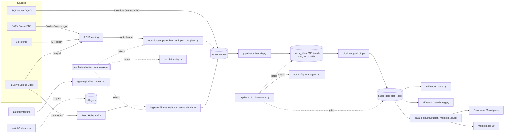

# Code & data-flow graph

```mermaid
flowchart LR
  subgraph Sources
    SAP[SAP / Oracle EBS]; SQL[SQL Server / QAD]; SFDC[Salesforce]; OT[PLCs via Litmus Edge]
  end
  SAP -->|GoldenGate avro_op| L[ADLS landing]
  SFDC -->|API export| L
  OT -->|UNS topics| EH[Event Hubs Kafka]
  OT -->|parquet| L
  SQL -->|Lakeflow Connect CDC| B
  L -->|Auto Loader| T1[ingestion/templates/bronze_ingest_template.py]
  EH --> T2[ingestion/litmus_ot/litmus_eventhub_dlt.py]
  T1 --> B[(nucor_bronze)]
  T2 --> B
  CFG[[config/replication_sources.yaml]] -.drives.-> T1 & T2 & DEP[scripts/deploy.py]
  B --> S1[pipelines/silver_dlt.py] --> S[(nucor_silver 3NF insert-only, hk=sha256)]
  S --> G1[pipelines/gold_dlt.py] --> G[(nucor_gold star + agg)]
  G --> FS[ml/feature_store.py] & VS[ai/vector_search_rag.py] & P[data_products/publish_marketplace.sql]
  P --> MKT[Databricks Marketplace] & UI[marketplace-ui/]
  DQ[dq/dama_dq_framework.py] -.gates.-> S & G
  DQ -->|breach| RCA[agents/dq_rca_agent.md]
  JOBFAIL[Lakeflow failure] --> HEAL[agents/pipeline_healer.md]
  VAL[scripts/validate.py] -.CI gate.-> ALL[(all layers)]
```
