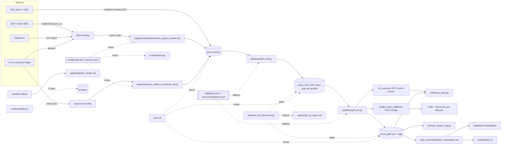

# Code & data-flow graph

Files referenced above that don't exist yet in this repo (`ingestion/templates/bronze_ingest_template.py`,
`ingestion/litmus_ot/litmus_eventhub_dlt.py`, `scripts/deploy.py`, `ml/feature_store.py`,
`ai/vector_search_rag.py`, `data_products/publish_marketplace.sql`, `marketplace-ui/`) describe the
target design, not the current state — tracked as open gaps, same as `docs/SESSION_NOTES.md`'s
2026-07-05 gap analysis. What's real and running today: `pipelines/silver_dlt.py` and
`pipelines/gold_dlt.py`, deployed via `databricks.yml`/`resources/pipelines.yml`, reading from
Bronze tables seeded directly from `scripts/generate_synthetic_data.py` output (no ingestion pipeline
yet — see `docs/ARCHITECTURE.md`'s Deployment section) and `config/seed_layer_mappings.sql`-seeded
config tables; `sql/*.sql` traces a row through all three layers end to end against that real data;
and `agents/*.py` — six platform agents (DQ monitor+RCA, schema evolution, product creator,
vector/content, deployment gate, operational intel) deployed as two serverless jobs via
`resources/agents.yml`, sharing `agents/agent_core.py` (read-only-SQL tool guard, decision logging to
`audit.agent_runs`, reports to `audit.agent_reports`). Agents run deterministic checks always and add
Claude reasoning (claude-opus-4-8) when the Databricks secret `agents/anthropic_api_key` (or env
`ANTHROPIC_API_KEY`) is present; without it they run in deterministic mode. The DQ agent populates
`audit.dq_results` (closing validate.py check 10); the product creator ships
`acme_products.sales.v_sales_orders_unified`; the content agent builds
`acme_gold.sales.customer_narratives`.

